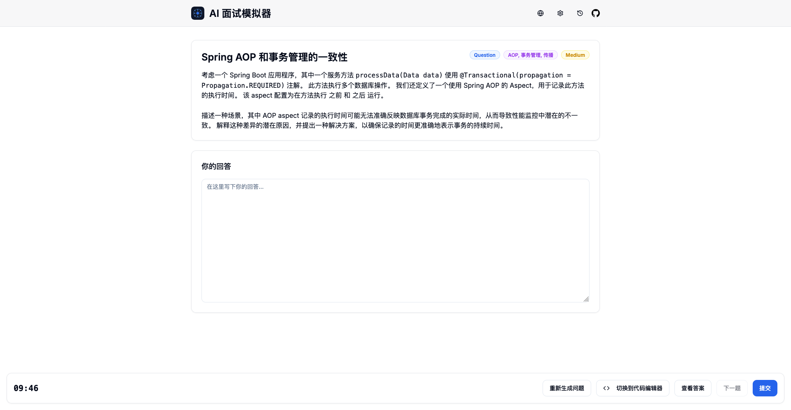

<p align="center">
  
</p>

<h1 align="center">AI 随机面试模拟器</h1>

<p align="center">
  <a href="LICENSE"></a>
  
  
  
  <br>
  <strong>中文</strong> | <a href="README_EN.md">English</a>
</p>

<p align="center">
  🚀 一款极具 Apple 风格的 AI 驱动技术面试平台，助你轻松提升编码技能与技术实力
</p>

<p align="center">
  
</p>

## ✨ 主要功能

- 🎯 **真实的面试体验**：模拟真实面试环境，提供编码挑战与技术问题
- 🍎 **精美 Apple 风格 UI**：优雅、现代且直观的用户界面，灵感源自 Apple 设计语言
- 🤖 **AI 驱动反馈**：获取由 OpenAI 支持的专业详细反馈与改进建议
- 👨‍💻 **强大代码编辑器**：支持多种编程语言、代码高亮、自定义主题和字体大小
- 🌐 **多语言支持**：切换使用中文或英文进行练习
- 📊 **智能学习**：系统会追踪你的错误并优先安排你需要加强的问题
- 🔄 **灵活筛选**：通过"重新生成问题"功能快速跳过不相关问题
- 📝 **历史记录**：查看过往表现，识别需要改进的领域
- 💾 **自动保存**：不用担心意外关闭，答题进度自动保存

## 🛠️ 技术栈

- [Next.js 15](https://nextjs.org/) - 最新版 React 框架
- [Tailwind CSS](https://tailwindcss.com/) - 实用优先的 CSS 框架
- [shadcn/ui](https://ui.shadcn.com/) - 精美 UI 组件库
- [OpenAI API](https://openai.com/api/) - AI 驱动的问题生成和答案评估
- [Monaco Editor](https://microsoft.github.io/monaco-editor/) - VS Code 同款代码编辑器

## 🚀 快速开始

### 本地开发

```bash
# 克隆仓库
git clone https://github.com/peanut996/random-interview-platform.git
cd random-interview-platform

# 安装依赖
pnpm install

# 启动开发服务器
pnpm run dev
```

应用将在 http://localhost:3000 运行

### 配置 OpenAI

在应用的设置菜单中，配置以下内容：

1. OpenAI API 端点 (通常为 `https://api.openai.com/v1`)
2. 选择模型 (推荐使用 `gpt-4o`)
3. 输入你的 OpenAI API 密钥

## 🎯 自定义设置

通过设置面板，你可以：

- 选择问题类型：编程题或概念问答题
- 自定义技术类别：添加你想要练习的特定技术领域
- 设置难度级别：从简单到困难
- 配置编辑器：选择主题、字体大小和编程语言
- 配置 OpenAI 参数：端点、模型和 API 密钥

## 🤝 贡献题库

通过内置的贡献功能，你可以轻松地向平台添加新题目：

- **文本贡献**：直接粘贴包含面试问题的文本内容
- **URL 贡献**：提供包含面试问题的网页链接
- **编辑与确认**：解析后可编辑问题详情，包括标题、类型、难度和分类
- **自动处理**：系统会自动创建 Pull Request，帮助你将题目合并到题库中

贡献的问题将帮助所有平台用户提高技能水平。

## 🌟 特色功能

### ✅ 专业编码环境

内置Monaco编辑器（VS Code同款），支持12种主流编程语言、多种编辑器主题和实时代码预览。

### 📱 响应式设计

在任何设备上都能获得出色的使用体验 - 桌面端、平板或手机。

### 🔍 详细分析

提交答案后获取全面评分和详细反馈，包括代码正确性、效率和可读性方面的建议。

## 📬 问题反馈

如果你有任何问题或建议，欢迎：

- 提交 [GitHub Issue](https://github.com/peanut996/random-interview-platform/issues)

## 📄 许可证

[MIT](LICENSE)
