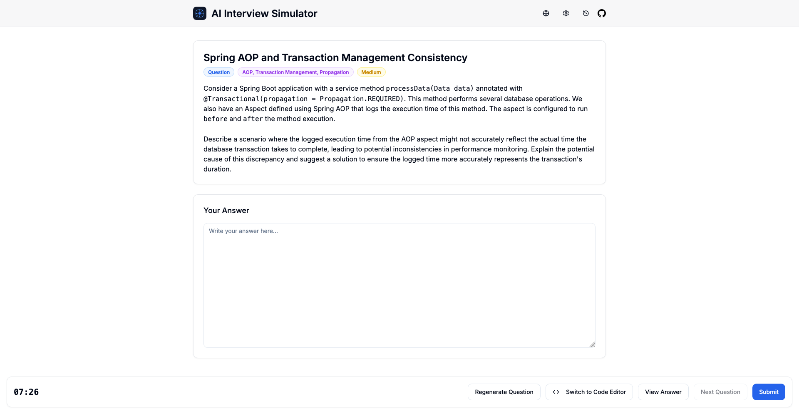

<p align="center">
  
</p>

<h1 align="center">AI Interview Simulator</h1>

<p align="center">
  <a href="LICENSE"></a>
  
  
  
  <br>
  <a href="README.md">中文</a> | <strong>English</strong>
</p>

<p align="center">
  🚀 An Apple-style AI-powered technical interview platform to help you improve your coding skills effortlessly
</p>

<p align="center">
  
</p>

## ✨ Key Features

- 🎯 **Realistic Interview Experience**: Simulates real interview environments with coding challenges and technical questions
- 🍎 **Beautiful Apple-Style UI**: Elegant, modern, and intuitive interface inspired by Apple's design language
- 🤖 **AI-Powered Feedback**: Get detailed professional feedback and improvement suggestions powered by OpenAI
- 👨‍💻 **Powerful Code Editor**: Supports multiple programming languages, syntax highlighting, customizable themes and font sizes
- 🌐 **Multi-Language Support**: Practice in English or Chinese
- 📊 **Smart Learning**: System tracks your mistakes and prioritizes areas you need to strengthen
- 🔄 **Flexible Filtering**: Quickly skip irrelevant questions with the "Regenerate Question" feature
- 📝 **History Tracking**: Review past performance and identify areas for improvement
- 💾 **Auto-Save**: Never lose your progress with automatic saving of answers

## 🛠️ Technology Stack

- [Next.js 15](https://nextjs.org/) - Latest React framework
- [Tailwind CSS](https://tailwindcss.com/) - Utility-first CSS framework
- [shadcn/ui](https://ui.shadcn.com/) - Beautiful UI component library
- [OpenAI API](https://openai.com/api/) - AI-powered question generation and answer evaluation
- [Monaco Editor](https://microsoft.github.io/monaco-editor/) - Same editor used in VS Code

## 🚀 Quick Start

### Local Development

```bash
# Clone repository
git clone https://github.com/peanut996/random-interview-platform.git
cd random-interview-platform

# Install dependencies
pnpm install

# Start development server
pnpm run dev
```

Application will run at http://localhost:3000

### OpenAI Configuration

In the app's settings menu, configure:

1. OpenAI API endpoint (typically `https://api.openai.com/v1`)
2. Choose model (recommended: `gpt-4o`)
3. Enter your OpenAI API key

## 🎯 Custom Settings

Through the settings panel, you can:

- Select question type: coding problems or conceptual questions
- Customize technical categories: add specific technology areas you want to practice
- Set difficulty level: from easy to hard
- Configure editor: choose theme, font size, and programming language
- Configure OpenAI parameters: endpoint, model, and API key

## 🌟 Featured Capabilities

### ✅ Professional Coding Environment

Built-in Monaco editor (same as VS Code) supporting 12 popular programming languages, multiple editor themes, and real-time code preview.

### 📱 Responsive Design

Enjoy an excellent user experience on any device - desktop, tablet, or mobile.

### 🔍 Detailed Analysis

Get comprehensive scoring and detailed feedback after submitting answers, including suggestions for code correctness, efficiency, and readability.

## 📬 Feedback

If you have any questions or suggestions, feel free to:

- Submit a [GitHub Issue](https://github.com/peanut996/random-interview-platform/issues)

## 📄 License

[MIT](LICENSE)
